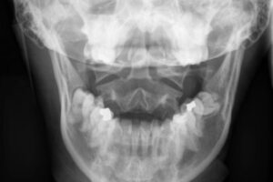
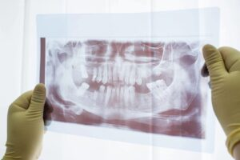
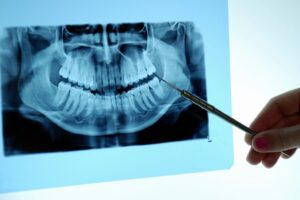
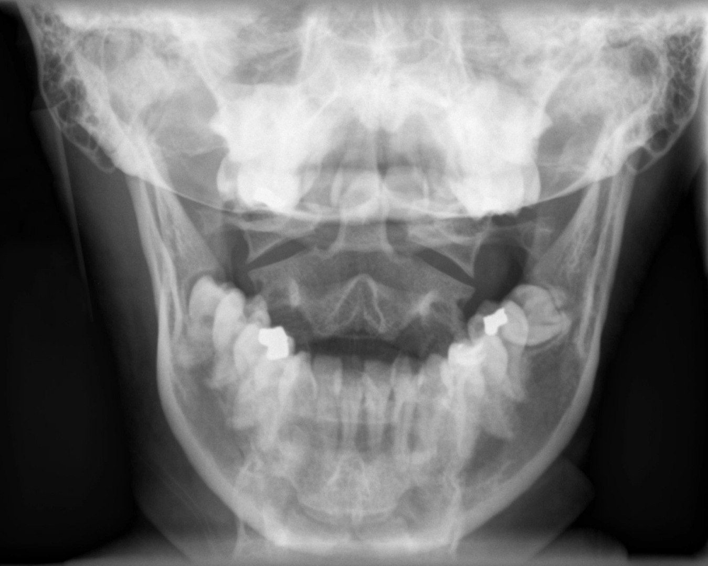

# Articles, Presentation and Blog | TMJ California

> _At TMJ California in Alameda, CA, our team shares articles and presentations related to movement disorders and TMJ. Reach out to us to learn more._

### TMJ and Systemic Health: The Missing Link

## Helpful Dental Orthopedic Reading Resources

#### [Tourette’s and Other Movement Disorders](https://tmjcalifornia.com/2021/03/tourettes-and-othermovement-disorders/ "Tourette’s and OtherMovement Disorders")

###### By [TMJ California](https://tmjcalifornia.com/author/pwsadmin/) | Mar 23, 2021

Posted on June 1, 2016 by Dr. Jennings Tourette’s and ...

[Read More →](https://tmjcalifornia.com/2021/03/tourettes-and-othermovement-disorders/)

#### [The Connection](https://tmjcalifornia.com/2021/03/the-connection/ "The Connection")

Is often discounted by many doctors as they are often ...

[Read More →](https://tmjcalifornia.com/2021/03/the-connection/)

#### [Multiple Articles](https://tmjcalifornia.com/2021/03/multiple-articles/ "Multiple Articles")

###### By [TMJ California](https://tmjcalifornia.com/author/pwsadmin/) | Mar 23, 2021

Have been published linking movement disorders to craniomandibular dysfunction: Tourette’s ...

[Read More →](https://tmjcalifornia.com/2021/03/multiple-articles/)

#### [Most All Modern Humans Have Substantial Craniomandibular Dysfunction](https://tmjcalifornia.com/2021/03/most-all-modern-humans-have-substantial-craniomandibular-dysfunction/ "Most All Modern Humans Have Substantial Craniomandibular Dysfunction")

(All primitive humans bit tip-to-tip, most modern humans have an ...

[Read More →](https://tmjcalifornia.com/2021/03/most-all-modern-humans-have-substantial-craniomandibular-dysfunction/)

#### [TMJ and Systemic Health: The Missing Link](https://tmjcalifornia.com/2021/03/tmj-and-systemic-healththe-missing-link/ "TMJ and Systemic Health:The Missing Link")

###### By [TMJ California](https://tmjcalifornia.com/author/pwsadmin/) | Mar 23, 2021

Posted on October 1, 2015 by Dr. Jennings The Question ...

[Read More →](https://tmjcalifornia.com/2021/03/tmj-and-systemic-healththe-missing-link/)

#### [TMJ Articles](https://tmjcalifornia.com/2021/03/tmj-articles/ "TMJ Articles")

These are articles that I believe are of great significance.Articles ...

[Read More →](https://tmjcalifornia.com/2021/03/tmj-articles/)

#### [Other Articles](https://tmjcalifornia.com/2021/03/other-articles/ "Other Articles")

###### By [TMJ California](https://tmjcalifornia.com/author/pwsadmin/) | Mar 23, 2021

Substance P Cascade as a Result of Jaw Malalignment; Dr. Jennings, 2010New ...

[Read More →](https://tmjcalifornia.com/2021/03/other-articles/)

#### [Basis of Craniomandibular Therapy in Elder Care](https://tmjcalifornia.com/2021/03/basis-of-craniomandibular-therapy-in-elder-care/ "Basis of Craniomandibular Therapy in Elder Care")

Occlusion and Brain FunctionUse of Jaw Orthopedic Therapy in an Anti-aging ...

[Read More →](https://tmjcalifornia.com/2021/03/basis-of-craniomandibular-therapy-in-elder-care/)

#### [AAGO Presentation 2012 References](https://tmjcalifornia.com/2021/03/aago-presentation-2012-references/ "AAGO Presentation 2012 References")

###### By [TMJ California](https://tmjcalifornia.com/author/pwsadmin/) | Mar 23, 2021

Tourrette1Trigeminal Research in DogsTachykinin Receptors and AsthmaSubstance P and HematopoiesisSubstance ...

[Read More →](https://tmjcalifornia.com/2021/03/aago-presentation-2012-references/)

### Search Posts

### Recent Posts

- [TMJ and Systemic Health:  
  The Missing Link](https://tmjcalifornia.com/2021/03/tmj-and-systemic-healththe-missing-link/)
  March 23, 2021
- [Most All Modern Humans Have Substantial Craniomandibular Dysfunction](https://tmjcalifornia.com/2021/03/most-all-modern-humans-have-substantial-craniomandibular-dysfunction/)
  March 23, 2021
- [Multiple Articles](https://tmjcalifornia.com/2021/03/multiple-articles/)
  March 23, 2021
- [The Connection](https://tmjcalifornia.com/2021/03/the-connection/)
  March 23, 2021
- [Tourette’s and Other  
  Movement Disorders](https://tmjcalifornia.com/2021/03/tourettes-and-othermovement-disorders/)
  March 23, 2021

### Categories

### Subscribe!

Please enter your name.

Please enter a valid email address.

[Sign Me Up!](#)

Thanks for subscribing! Please check your email for further instructions.

Something went wrong. Please check your entries and try again.